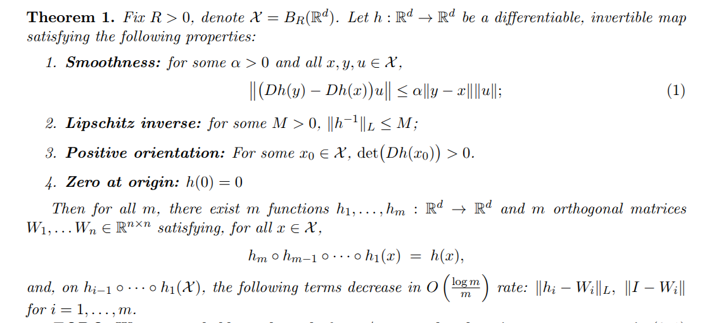

# orthogonal-skip-connections (OrthResNet)

A research codebase that explores the idea of replacing skip connections in ResNets to orthogonal matrices.

Inside the [paper/orthogonal_skip_connections.pdf](paper/orthogonal_skip_connections.pdf) we show a mathematical construction of OrthResNet, that shares many convergence properties of the original ResNet architecture, with more degrees of freedom:



The purpose of this codebase is to evaluate if this theoretical result is actually useful: initial experiments show that doesn't work that well in practice, contradicting previous investigations presented in: [Orthogonal and Idempotent Transformations for Learning Deep Neural Networks
](https://arxiv.org/abs/1707.05974). 


## Quick-start
```bash
# 1. create an isolated environment & install deps
uv venv && source .venv/bin/activate
uv pip install -e .[experiments]

# 2. learnable orthogonal variant
uv run python -m orthogonal_skip_connections.experiments.run_experiments model.skip_kind=learnable_orth

# 2. baseline ResNet on CIFAR-100
uv run python -m orthogonal_skip_connections.experiments.run_experiments model.skip_kind=identity dataset=cifar100
```

## Experiments

### CIFAR Training

```bash 
uv run python -m orthogonal_skip_connections.experiments.run_experiments model.skip_kind=identity dataset=cifar100
```

## Comparison of weight transformations on synthetic data

```bash
uv run python -m orthogonal_skip_connections.experiments.orth_residual_synthetic_data dataset_type=circles
```

## Comparison of weight trajectories on synthetic data

```bash
uv run python -m orthogonal_skip_connections.experiments.orth_to_id
```

## TODO

- [x] Modularize synthetic data experiments and use hydra
- [x] How valid is the construction introduced by Bartlett et al. (2018)? How often do models converge to it?
  - Update: we observed matrices didn't converge to identity - both in a synthetic data setting and in a CIFAR-100 training setting. Hence the model is not really valid, suggesting a more general construction than presented here - weight matrices don't need to converge to identity.

- [ ] Explore the scheme of training where we first train the model with identity skip connections, then approximate each non-linear connection with an orthogonal connection and adjust the weights of non-linear connection.
- [ ] Literature review of related papers
  - [ ] What is the effect of orthogonal residual updates? (new paper)
- [ ] See what happens when we increase the dimensions further in `orthogonal_skip_connections.experiments.orth_to_id`. Currently we only saw it in 2D and 3D and binary classification. I couldn't construct a general dataset in which the model didn't achieve 100% immediately on high-dimensional data.
- [ ] Explore ViT architectures

## Citation
If you use this codebase in your research, please cite it:

```bibtex
@misc{orthogonal_skip_connections,
  title = {Orthogonal Skip Connections},
  author = {Filip Morawiec},
  year = {2025},
    publisher = {GitHub},
    journal = {GitHub repository},
}
```
